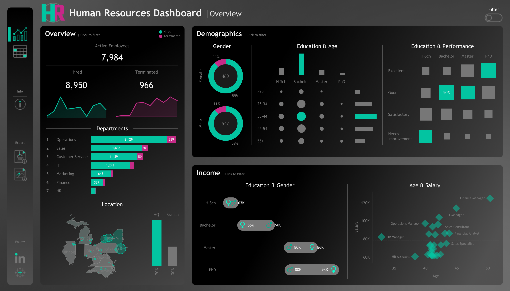
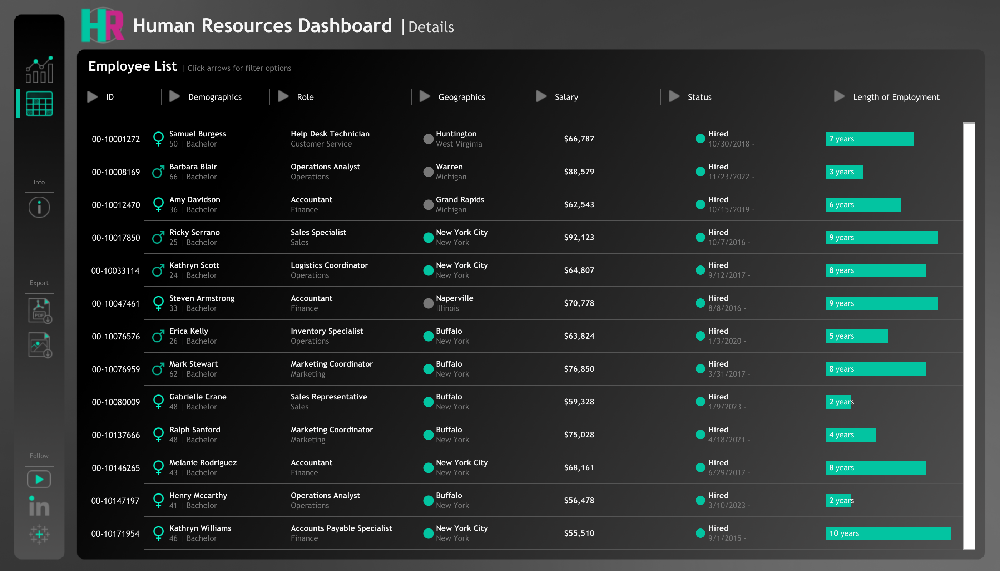

# 🧠 Human Resources Dashboard  

## 📌 Overview  
This **Human Resources Dashboard** provides an interactive, data-driven overview of employee statistics, demographics, and performance insights. Built with **Tableau**, the dashboard helps HR teams make informed decisions quickly and efficiently.  

---

## 🎯 Key Features  

- **Employee Overview:** Tracks active employees, hires, and terminations over time.  
- **Department Breakdown:** Visualizes headcount and turnover rates across different departments.  
- **Demographics Analysis:** Displays gender distribution, education levels, and age groups.  
- **Performance Insights:** Correlates education with performance ratings to identify trends.  
- **Income Analysis:** Compares salaries by gender, education, and age brackets.  
- **Employee List View:** Detailed employee records with role, salary, location, and employment duration.  

---

## 📊 Visuals  

### 🔍 **Summary View**  

### 🛠️ **Details View**  

---

## 🚀 What I Learned  

- **Created 3 interactive dashboards** and published them online for easy sharing.  
- **Connected to various data sources** like Excel, Google Sheets, and Cloud Servers.  
- **Built different visualizations** including bar charts, line charts, donut charts, maps, tables, and dual-axis charts.  
- **Developed calculated fields** with **IF Statements**.  
- **Created sets, hierarchies, and groups** to organize data.  
- **Understood joins** and how to combine datasets efficiently.  
- **Explored Level of Detail (LOD) calculations** to control data granularity.  
- **Created Parameters** for more interactive filtering and control.  
- **Used the analytics pane** — added trend lines and other insights.  
- **Implemented dashboard actions** to create fully interactive dashboards.  
- **Built a live-updating dashboard** connected to Google Sheets for daily refreshes.  
- **Enhanced the design** using **Figma** for a cleaner, more professional look.  

---

## 🌟 Author  
**Sharan Ganti**  
Feel free to connect on [LinkedIn](https://www.linkedin.com/in/sharan-ganti/)  

---

Would you like me to refine this further — maybe with more visual polish or a license section? 🚀✨  
